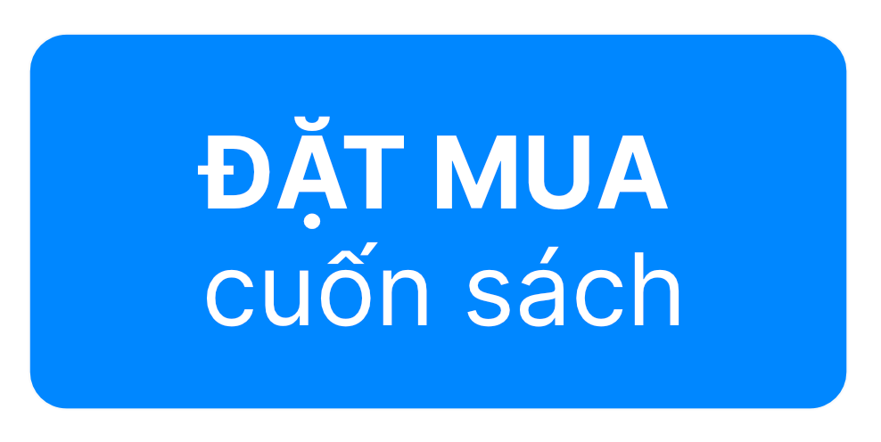
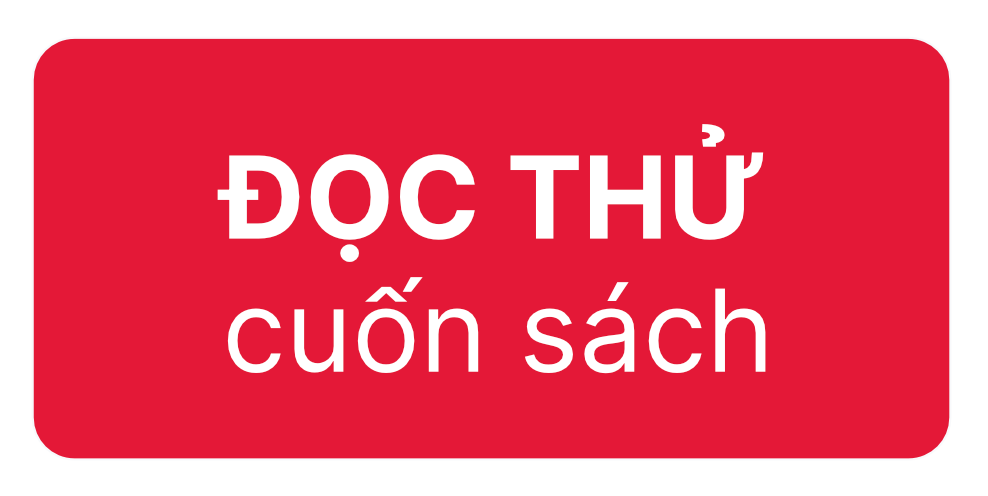

Bạn thân mến,

Cảm ơn bạn đã tin tưởng và ủng hộ cho cuốn sách này. 
Dưới đây là một vài thông tin bạn cần nắm trước khi bạn thực hiện đặt sách.

## Thông tin Chung

| Phát hành Tập 1         | **20/08/2021**                  |
|-------------------------|---------------------------------|
| Số trang Tập 1          | 284                             |
| Dự kiến Phát hành Tập 2 | Quý III, năm 2022               |
| Hình thức phát hành     | Sách điện tử                    |
| Định dạng sách          | PDF                             |
| Lộ trình Nội dung       | [Xem chi tiết](./lo-trinh.html) |

## Cam kết Bảo mật
Cuốn sách này được MLBVN Group cho phép độc giả tải về và đọc trên thiết bị cá nhân.
Hãy đảm bảo bạn đọc kỹ và đồng thuận với những thông tin này. Bằng việc đặt mua cuốn sách, 
chúng tôi hiểu rằng bạn đồng ý với Cam kết Bảo mật từ MLBVN.

### Về cung cấp Thông tin
Hãy cung cấp email:

 Là email từ Google (đuôi @gmail.com). 
Nhóm không nhận email từ Yahoo, Outlook, hoặc các nhà cung cấp dịch vụ mail khác. 
 Mail cá nhân với tên thật của bạn được 
ghi ở trong mail.

Không cung cấp:

 Email thuộc sở hữu từ công ty, 
tổ chức, trường học. 
 Email này là địa chỉ group mail dùng 
cho nhóm hoặc tổ chức. 
 Email có tên không rõ ý nghĩa hoặc có 
khả năng là mail dùng chung, nằm ngoài phạm vi sử dụng cá nhân.

Để hiểu hơn, vui lòng nhìn hình minh họa ở phía dưới

### Về quyền Sử dụng sách
Bạn được:

 Đọc sách dưới định dạng được cung cấp. 
 Sử dụng nội dung sách cho mục đích học 
tập, nghiên cứu.

Bạn không được:

 Cố gắng thực hiện việc sao chép, lưu trữ, 
phát tán, phân bổ tệp tin và các nội dung của cuốn sách lên Internet mà không có sự đồng 
thuận bằng văn bản từ MLBVN. 
 Chia sẻ tệp tin sách bạn nhận được cho 
người khác. 
 Chuyển đổi sang dạng tệp tin khác nhằm xóa bỏ 
DRM mặc định. 
 Tìm cách xóa bỏ Watermark từ tệp tin sách mà 
chúng tôi cung cấp. 
 In ấn cuốn sách (với bất kỳ mục đích gì).

## Đặt sách

Vì cuốn sách này được thực hiện với mục tiêu cộng đồng, chúng tôi mong muốn cuốn sách 
có thể đến được với nhiều độc giả hơn. Tập 1 hiện tại có chi phí là **200,000đ ($9,4)**.

## Câu hỏi Thường gặp (FAQ)

<dl>
<dt>Có thể tải cuốn sách này về không?</dt>
<dd>Được, bạn có thể tải bản PDF của cuốn sách này. Tuy nhiên, hãy đảm bảo rằng bạn đã đọc kỹ 
<b><a href="#cam-ket-bao-mat">Cam kết Bảo mật</a></b> từ chúng tôi.</dd>
<dt>Cuốn sách này có bản in cứng không?</dt>
<dd>Không, hiện tại chúng tôi chưa có kế hoạch cho một bản in. Trong tương lai có thể có.</dd>
<dt>Tôi cần trang bị những gì để có thể tiếp thu cuốn sách này trọn vẹn?</dt>
<dd>Bạn cần có kinh nghiệp lập trình Python và đã có kinh nghiệm sử dụng các thư viện khoa học của Python,
ở đây cụ thể là NumPy, Pandas, và Matplotlib. Đồng thời, nếu bạn  quan tâm đến các kiến thức nền tảng, 
bạn cần kha khá kiến thức toán đại học như giải tích, đại số tuyến tính, xác suất và thống kê.</dd>
<dt>Mình chưa từng bắt tay vào lập trình, có một chút ít kiến thức về toán, liệu có phù hợp để đọc không?</dt>
<dd>Cuốn sách này phù hợp khi bạn mong muốn tìm hiểu. Bạn sẽ cần nhiều thời gian hơn để có thể tiếp cận,
mặc dù sách sẽ gợi ý bạn một vài nguồn để bạn tự trang bị kiến thức về lập trình và toán; 
hành trình này sẽ không dễ dàng. Mong bạn kiên nhẫn với chính mình.</dd>
<dt>Mình muốn mua tặng người khác có được không?</dt>
<dd>Được, bạn hãy điền thông tin của người được tặng vào <a href="./form.html">biểu mẫu đặt sách</a>, 
đồng thời <a href="https://fb.com/mlbvn.org/">nhắn tin cho chúng tôi</a> nhé.</dd>
</dl>

## Hỗ trợ

Các hỏi đáp & hỗ trợ liên quan đến đặt sách và nội dung sách, độc giả có thể gửi đến 
địa chỉ [handson-ml@mlbvn.org](mailto:handson-ml@mlbvn.org), 
hoặc [Facebook Page của Nhóm dịch thuật](https://fb.com/mlbvn.org/) để chúng tôi có thể hỗ trợ.

Ngoài ra, chúng tôi khuyến khích độc giả thảo luận, hỏi đáp, 
và phản hồi trên [Github Discussions](https://github.com/mlbvn/handson-ml2-vn/discussions).

Cảm ơn quý độc giả đã ủng hộ chúng tôi.

Thân mến, 
**Nhóm dịch thuật Machine Learning Cơ Bản**
